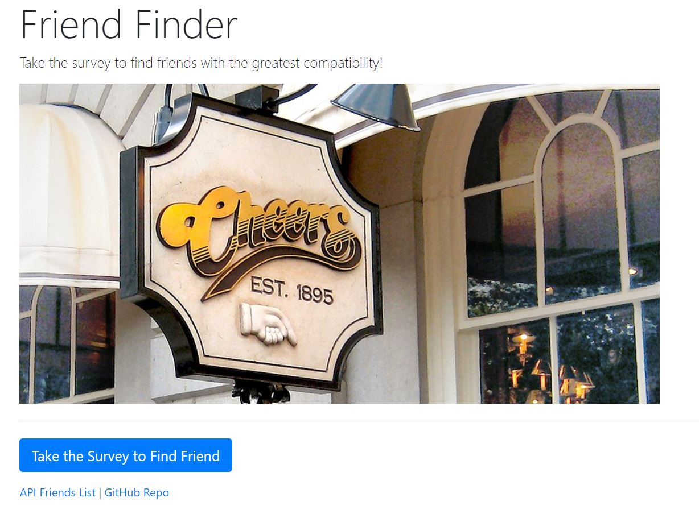

# Friend Finder

## Technology
* JavaScript, Node.js, Express.js, Heroku, Path
* Friend Finder Application Webpage on Heroku: https://ancient-reef-27838.herokuapp.com/
* GitHub Repository: https://github.com/boogeybum/friendFinder.git

## About
* Friend Finder is an app that the user fills out an online survey, adds their information to the json data and returns a 'friend' with a total score that most closely matches. The provided friends is of fictional characters and their values are based off of my best guess.

## License 
* No license explicite or implied.

## How-to use this code
* After landing on the home page, click on the 'Take the Survey to Find Friend' button at the bottom of the page. From their add your name and add a link to your picture. Answer each question by select 1 through 5. 1 being 'strongly disagree' and 5 being 'strongly agree'. Answer all the questions and then click 'submit'. Your answers will be compared to the existing friend entries to reveal the picture of your new 'friend' with the most closely matched score. This will also add you to the list for future comparison.

## Contributing Guidelines
All contributions and suggestions are welcome!
For direct contributions, please fork the repository and file a pull request. 

## Contact
#### Developer/Full-stack Web Software Developer (in training)
* Homepage: https://boogeybum.github.io/Bootstrap-Portfolio/
* e-mail: cseastrand@gmail.com
* Twitter: @cseastrand
* LinkedIn: https://www.linkedin.com/in/clayton-seastrand-43a76861/
